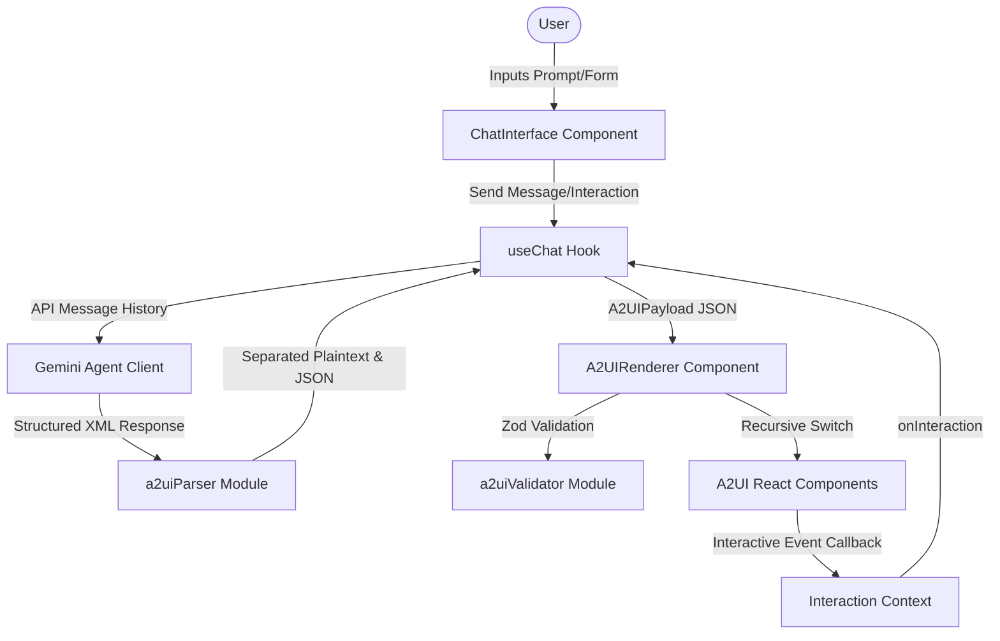

# ThinkAI A2UI Renderer

ThinkAI is a high-fidelity React + TypeScript application demonstrating a production-grade **A2UI (Agent-to-User Interface) renderer**. This framework parses structured XML-wrapped JSON payloads returned by an AI backing agent (like Google Gemini) and dynamically generates interactive visual interfaces directly inline inside chat conversation bubbles.

---

## 1. Architecture Diagram



---

## 2. Setup Instructions

To run this application locally, follow these steps:

1. **Navigate to the project directory**:
   ```bash
   cd E:\Projects\thinkai-a2ui-renderer
   ```
2. **Install dependencies**:
   ```bash
   npm install
   ```
3. **Configure Environment Variables**:
   Create a `.env` file in the root directory and add your Google Gemini API Key:
   ```env
   VITE_GEMINI_API_KEY=your_gemini_api_key_here
   ```
   *Note: If no API key is specified, the application will display a warning requesting the key.*

4. **Start local development server**:
   ```bash
   npm run dev
   ```
   Open `http://localhost:5174/` in your browser.

5. **Run test suites**:
   ```bash
   npm run test
   ```

---

## 3. A2UI Component Reference

| Component Type | Purpose | Main Props | Example JSON snippet |
| :--- | :--- | :--- | :--- |
| **`container`** | Arranges nested child elements | `layout: "vertical" \| "horizontal" \| "grid"`, `gap` | `{"type": "container", "layout": "vertical", "children": [...]}` |
| **`card`** | Groups related content in a box | `title`, `subtitle`, `variant: "default" \| "elevated" \| "outlined" \| "success" \| "warning" \| "error"` | `{"type": "card", "title": "Profile", "variant": "elevated"}` |
| **`text`** | Renders typographic elements | `content`, `variant: "heading" \| "subheading" \| "body" \| "caption"`, `bold` | `{"type": "text", "content": "Header", "variant": "heading"}` |
| **`button`** | Triggers interactive handlers | `label`, `variant: "primary" \| "secondary"`, `size`, `action`, `icon` | `{"type": "button", "label": "Save", "variant": "primary", "action": "save"}` |
| **`text_field`** | Captures user inputs/messages | `name`, `label`, `placeholder`, `fieldType: "text" \| "email" \| "textarea"` | `{"type": "text_field", "name": "email", "fieldType": "email"}` |
| **`form`** | Collects multi-field inputs | `submitLabel`, `action`, `children` | `{"type": "form", "submitLabel": "Submit", "action": "send"}` |
| **`select`** | Renders options selector | `name`, `label`, `options: {value, label}[]` | `{"type": "select", "name": "rating", "options": [{"value":"5","label":"Great"}]}` |
| **`checkbox`** | Toggles true/false input options | `name`, `label`, `defaultChecked` | `{"type": "checkbox", "name": "agree", "label": "Accept terms"}` |
| **`graph`** | Renders charts using Recharts | `chartType: "bar" \| "line" \| "pie"`, `data: {label, value}[]` | `{"type": "graph", "chartType": "bar", "data": [{"label": "Jan", "value": 50}]}` |

---

## 4. Design Decisions

1. **Zod Validation (`a2uiValidator.ts`)**: Ensuring structure safety is critical for dynamic rendering. Every payload is parsed against a strict Zod schema before React mounts it. If validation fails, we capture it cleanly rather than crashing the interface.
2. **Context-Driven State (`A2UIContext.tsx`)**: Form values and interaction triggers are passed down using React Context providers. This prevents deep prop-drilling, makes nested layout elements cleaner, and isolates multi-form instances.
3. **Class ErrorBoundary Fallback**: A custom ErrorBoundary surrounds the renderer. If a child component throws a runtime error (e.g. invalid array parameters inside Recharts), the error is caught, and a styling fallback card is shown with a button to toggle the raw JSON representation.
4. **Typing Animation (`useStreamingText.ts`)**: To mimic real-time AI generation, messages are animated character-by-character. Interactive visual widgets are stagger-revealed with CSS keyframes to prevent layout shift and offer a smooth feel.

---

## 5. Testing Suite

The unit tests are written using **Vitest + React Testing Library** and cover:
- **Validators (`validators.test.ts`)**: Rejects version mismatches and missing required properties.
- **Parser (`a2uiParser.test.ts`)**: Extracts tags from raw response strings and parses inner JSON.
- **Form States (`useA2UIState.test.ts`)**: Tests updating and resetting form states.
- **Button click (`A2UIButton.test.tsx`)**: Fires event with target action IDs.
- **Form submit (`A2UIForm.test.tsx`)**: Gathers child input data values.
- **Core Renderer (`A2UIRenderer.test.tsx`)**: Asserts that all 9 components render correctly from structured JSON data.
